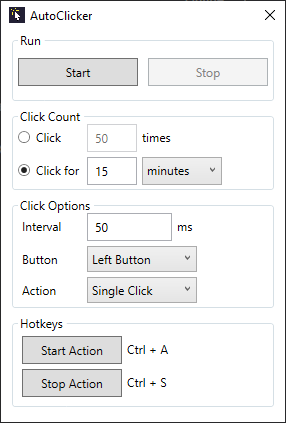

# AutoClicker

Simple auto clicker implementation made with C# (WPF). Release available for
download.

## Features

- Click (n) amount of times
- Click for (x) amount of time
- Custom click interval
- Left click / right click
- Single click / double click
- Hotkey remapping
- Persistent settings

## Screenshots

